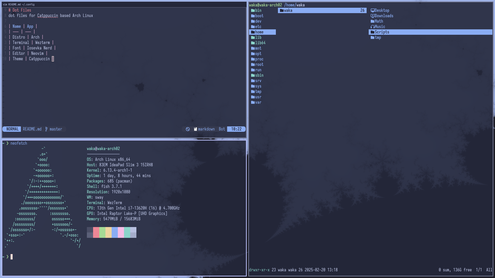

# Dot Files
dot files for Catppuccin based Arch Linux

## Screenshots


## Environment
### System
| Name | App |
| --- | --- |
| Distro | Arch |
| Shell | Fish |
| Font | Iosevka Nerd |
| Editor | Neovim |
| Theme | Catppuccin |

### Applications
- Firefox - Web browser
- [IMV](https://sr.ht/~exec64/imv/) - Image viewer
- [MPV](https://mpv.io/) - Media player
- [Ranger](https://github.com/ranger/ranger) - File manager
- [Fish](https://fishshell.com/) - Shell
- [Fuzzel](https://codeberg.org/dnkl/fuzzel) - Application launcher
- [Mako](https://github.com/emersion/mako) - notification service

## Installation
Run the following command
```bash
sudo pacman -S bemenu cpupower ddcutil firefox fish fisher fuzzel grim imagemagick imv inotify-tools jq libnotify light mako mpv neovim networkmanager plocate qt6-wayland qt6ct ranger scrot slurp sway swaybg swaylock ttf-iosevka-nerd ttf-liberation waybar wayland-utils wezterm wl-clipboard xdg-desktop-portal-gtk xdg-desktop-portal-wlr zathura zathura-pdf-mupdf
```
Then for fish configuration use
```fish
fisher install IlanCosman/tide@v6
```

## Keybindings
### Window Management
| Keys | Action |
| :--  | :-- |
| <kbd>Super</kbd> + <kbd>Q</kbd> | quit active/focused window
| <kbd>Super</kbd> + <kbd>O</kbd> | toggle window on focus to float
| <kbd>Super</kbd> + <kbd>o</kbd> | move between floating windows
| <kbd>Super</kbd> + <kbd>f</kbd> | toggle window on focus to fullscreen
| <kbd>Super</kbd> + <kbd>b</kbd> | change current windows layout to tabbed
| <kbd>Super</kbd> + <kbd>g</kbd> | toggle current split direction
| <kbd>Super</kbd> + <kbd>v</kbd> | explicit split window
| <kbd>Super</kbd> + <kbd>Shift</kbd> + <kbd>-</kbd> | move window to scratchpad
| <kbd>Super</kbd> + <kbd>-</kbd> | toggle scratchpad
| <kbd>Super</kbd> + <kbd>C</kbd> | reload sway
| <kbd>Super</kbd> + <kbd>R</kbd> | restart sway
| <kbd>Super</kbd> + <kbd>t</kbd> | resize mode

## Navigation
| Keys | Action |
| :--  | :-- |
| <kbd>Super</kbd> + <kbd>1 - 10</kbd> | move to workspace
| <kbd>Super</kbd> + <kbd>Shift</kbd> + <kbd>1 - 10</kbd> | move window to workspace
| <kbd>Super</kbd> + <kbd>Tab</kbd> | cycle workspace
| <kbd>Super</kbd> + <kbd>Shift</kbd> + <kbd>Tab</kbd> | cycle workspace backwards
| <kbd>Super</kbd> + <kbd>a</kbd> | focus parent
| <kbd>Super</kbd> + <kbd>d</kbd> | focus child
| <kbd>Super</kbd> + <kbd>h</kbd><kbd>j</kbd><kbd>k</kbd><kbd>l</kbd> | switch the focus around active windows
| <kbd>Super</kbd> + <kbd>Shift</kbd> + <kbd>h</kbd><kbd>j</kbd><kbd>k</kbd><kbd>l</kbd> | move focused window

## Run
| Keys | Action |
| :--  | :-- |
| <kbd>Super</kbd> + <kbd>`</kbd> | run terminal
| <kbd>Super</kbd> + <kbd>r</kbd> | run fuzzel launcher
| <kbd>Super</kbd> + <kbd>e</kbd> | run bemenu explorer
| <kbd>Super</kbd> + <kbd>n</kbd> | dismiss notification
| <kbd>Super</kbd> + <kbd>N</kbd> | dismiss all notifications
| <kbd>Super</kbd> + <kbd>c</kbd> | lock desktop

